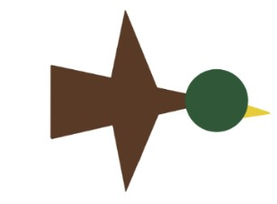

# Duck Hunt

# Duck
&emsp; The ducks are represented by several 2D geometric primitives (body, wings and head), 
suggestively positioned. You can see a construction of the duck in the image below, 
consisting of 4 triangles and a circle (one triangle each for the body, wings and beak, 
and the head represented by the circle).

### **Animation**

- Flight animation: 
  The duck flaps its wings using a simple rotation.
- It flies in various directions: 
  The entire assembly of objects that make up the duck move or rotate together.

### **Display**
&emsp; The ducks appear one by one on the screen, so that at a given moment there is only one 
duck present in the scene. When a duck is shot or escapes, the next one will be displayed.

### **Movement**
&emsp; Ducks appear at the bottom of the screen and begin their flight in a random direction 
in the plane. Continuing in that direction, they will eventually reach the edge of the screen. 
In this situation, the duck "reflects" and continues its journey in the related direction, like 
a billiard ball hitting the edge of the table. If the duck is shot, it will fall to the ground 
moving through a vertically downward animation, respectively if it escapes it will fly off the 
screen moving through a vertically upward animation.After a count of 5 seconds, in which the 
duck has collided with the edge of the screen a few times, it will escape.

# Lives
&emsp; The player initially starts with 3 lives. The moment a duck escapes (the player missed hitting 
the duck with all 3 bullets), it loses a life. The number of remaining lives are 
drawn on the screen in the lower left corner.

# Bullets
&emsp; At any point in time, the player knows how many bullets he has left. For this, in the lower 
left corner (next to the number of lives) the number of available bullets is also displayed.

# Score and difficulty
&emsp; For each duck shot, the player's score increases. It depends on the number of ducks shot 
and the difficulty. The difficulty increases when the player kills 5 birds. The higher the difficulty, 
the faster the score increases. Maximum difficulty is 9.

# Gameplay
&emsp; The goal of the game is for the player to shoot as many ducks as possible before they run out of lives. 
The game starts with a number of lives available, one of which is lost each time a duck manages to 
escape without being shot. The ducks appear one by one on the screen, one at a time, each after the 
disappearance (by escaping or shooting) of the other. previous. A duck will fall to the ground when 
shot and fly vertically upwards to symbolize escape.

### **Shotgun**
&emsp; To shoot a duck, the player has 3 bullets at his disposal which reload every time a new duck appears. 
Each time he clicks on the screen, it will be considered that a bullet was fired at that point on the 
screen and the number of available bullets will decrease by 1. If the point on the screen (details 
section "Bullet intersection with the duck") that was shot intersects the duck, it will be considered 
shot, the score (details section "Score") will increase and the duck will fall to the ground (details 
section "Ducks - Movement").

### **Duck Escape**
When all 3 bullets have been consumed without the duck being shot, it escapes. Also, if the duck has not 
been shot for a certain number of seconds, it will escape. In both situations where the duck escapes, the
player will lose a life (details in the "Lives" section) and will not receive the score related to that duck.